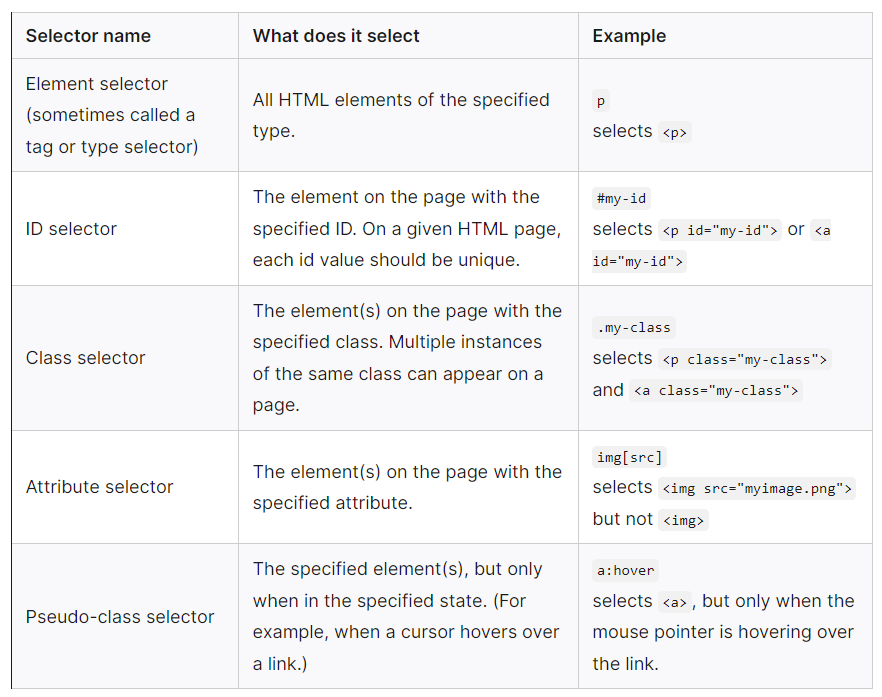

# 🦜 Introduction to CSS

> ### [Video Tutorial](https://www.youtube.com/watch?v=1PnVor36_40){:target="_blank"}

CSS(Cascading Style Sheets) is the code that styles the web content. It is a style-sheet language, not a programming or markup language.

> If HTML is the skeleton of our body then CSS is the skin

### 💫 CSS Syntax


#### There are 5 types of selectors:



### 📎 Ways to link CSS to HTML

- **Inline CSS** - uses style attribute of the HTML element

  **`index.html`**

  ```html
  <!--  This method is not ideal for complex CSS  -->

  <h1 style="color:blue;">A Blue Heading</h1>
  ```

- **Internal CSS** - using style element in a HTML document

  **`index.html`**

  ```html
  <!DOCTYPE html>
  <html>
    <head>
      <style>
        body {
          background-color: powderblue;
        }
        h1 {
          color: blue;
        }
        p {
          color: red;
        }
      </style>
    </head>

    <body>
      <h1>Hello</h1>
      <p>There</p>
    </body>
  </html>
  ```

- **External CSS** - a CSS file linked to the HTML document

  **`index.html`**

  ```html
  <!DOCTYPE html>
  <html>
    <head>
      <link rel="stylesheet" href="styles.css" />
    </head>

    <body>
      <h1>Hello</h1>
      <p>There</p>
    </body>
  </html>
  ```

  **`index.css`**

  ```css
  body {
    background-color: powderblue;
  }

  h1 {
    color: blue;
  }

  p {
    color: red;
  }
  ```

#### Additional Guides

There is no need to remember all of the CSS properties. Visual Studio Code includes an auto-hint for CSS, and you can always search online for CSS properties. **To familiarize yourself with HTML and CSS, experiment with it by creating your own designs.**

#### - [CSS Reference](https://cssreference.io/)

----
⏪ Back: [Introduction to HTML](./LEARN_HTML.md) • ⏭️ Next: [Javascript Basics](../javascript/JAVASCRIPT_BASICS.md)
